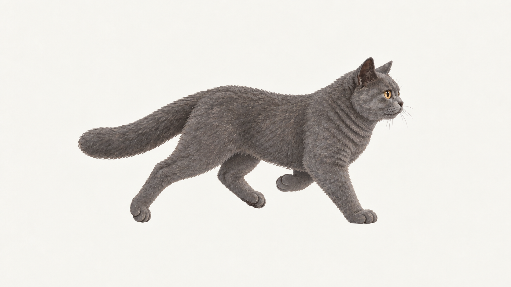
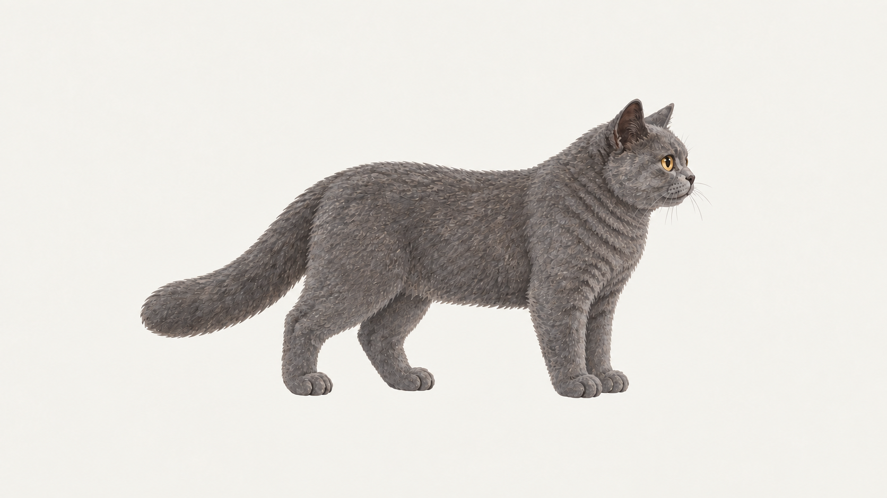

# 110 · 朝右跑步停稳

优先级：P0。分组：开场跑步。状态：返片已接入。以下保留原制作要求；检测见 docs/completion-v5-integration.md。包含新候选锚点，请先评审姿态、身份及接触高度，再投视频。

| 首帧 · RR | 尾帧 · SR |
|---|---|
|  |  |

上传本目录两张原图，复制[提示词.txt](提示词.txt)全文。

- 建议时长：0.8—1.2秒。
- 用途：跑到中点后衔接踱步。

## 完整提示词

110-朝右跑步停稳
接缝：RR → SR；类型：过渡
建议有效动作时长 0.8—1.2 秒，不统一做5秒。平台只有固定时长时，选不短于上限的最近时长；单次动作完成后仅保持尾姿态，循环则增加完整周期。不加速、倒放或插帧凑时长；返还原始视频及实际帧率。

固定机位与镜头，1672×941横画幅、浅暖灰干净背景。全程同一只2D成年蓝灰短毛陈皮，保持输入图头骨、胸廓、圆颊、短深鼻、轻嘴线、自然灰色嘴垫、金色眼睛及粗尾；精细绘本笔触，不改成照片、3D或幼猫。自身左眼略小，正面时为画面右眼，不镜像调换；侧面只见一眼时不强行扭脸，闭眼时不画眼球。四肢和尾数量正确，不变焦、不拉伸、不逐帧归一化外框。脚底或胸腹实际承重连续，尾尖不决定整猫高度。画面只有一只完整猫，不能生成墙、猫窝、盆、人手、绳索、衣服、地面线、台词、文字、气泡、特效或烘焙阴影。

首图：朝右跑步共用落脚相位。尾图：朝右四足站姿。

动作：从共用跑步相位逐步减速，前后脚真实落地承重，收稳为四足站姿；不急停冻结或突然坐下。

衔接：只执行一次指定动作，首尾严格抵达上传图的真实姿态；进入退出自然，末端最多轻稳约0.2秒，不跳切、溶解、交叉淡化或突然缩放。首尾相同也必须完成中间动作，不能生成静帧。 固定跑步机式机位，身体中心保持在固定画幅内，四肢真实跑动；桌面世界位移后续由程序与脚底速度配准，不让猫跑出画面。

全程静音生成，口型与后期音效分开；无语音、台词、音乐。

## 返片验收

原视频保留字节及帧率；扫描全部相邻帧、循环和行为接缝，宽高分别测量，承重脚/胸腹单独检查。不能把总外框或尾尖当高度基准。跑步检查脚底位移与速度；左右离窝检查坐垫支撑和家具层级。相同画布及首尾文件哈希不等于动画或几何已通过。
