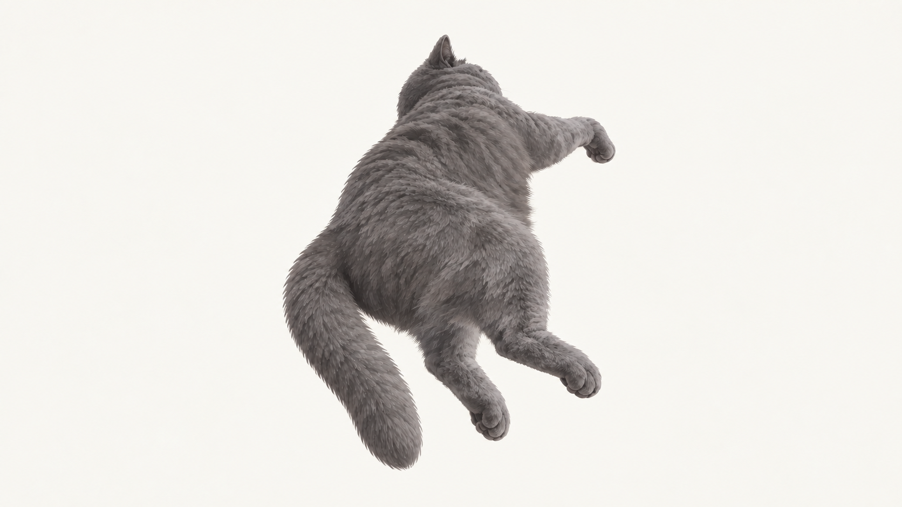

# 135 · 舒展对应悬空轻摆

优先级：P3。分组：拖拽补齐。状态：返片已接入。以下保留原制作要求；检测见 docs/completion-v5-integration.md。包含新候选锚点，请先评审姿态、身份及接触高度，再投视频。

| 首帧 · H_X | 尾帧 · H_X |
|---|---|
|  |  |

上传本目录两张原图，复制[提示词.txt](提示词.txt)全文。

- 建议时长：2—3秒。
- 用途：悬空循环需独立匹配本姿态起提。

## 完整提示词

135-舒展对应悬空轻摆
接缝：H_X → H_X；类型：循环
建议有效动作时长 2—3 秒，不统一做5秒。平台只有固定时长时，选不短于上限的最近时长；单次动作完成后仅保持尾姿态，循环则增加完整周期。不加速、倒放或插帧凑时长；返还原始视频及实际帧率。

固定机位与镜头，1672×941横画幅、浅暖灰干净背景。全程同一只2D成年蓝灰短毛陈皮，保持输入图头骨、胸廓、圆颊、短深鼻、轻嘴线、自然灰色嘴垫、金色眼睛及粗尾；精细绘本笔触，不改成照片、3D或幼猫。自身左眼略小，正面时为画面右眼，不镜像调换；侧面只见一眼时不强行扭脸，闭眼时不画眼球。四肢和尾数量正确，不变焦、不拉伸、不逐帧归一化外框。脚底或胸腹实际承重连续，尾尖不决定整猫高度。画面只有一只完整猫，不能生成墙、猫窝、盆、人手、绳索、衣服、地面线、台词、文字、气泡、特效或烘焙阴影。

首图：对应背朝观察者、近臀远头、不见正脸的舒展的受托悬空姿态，四肢失去地面支撑后自然松垂。尾图：对应背朝观察者、近臀远头、不见正脸的舒展的受托悬空姿态，四肢失去地面支撑后自然松垂。

动作：保持对应悬空姿态，轻微重力摆动，四肢和尾巴自然活动后回同相位；无激烈挣扎。

衔接：完成自然运动的完整周期。上传首尾为同一文件，必须有中间动作，起止相位和速度连续，不在尾部减速或定格，不倒放凑循环。 起提/下降必须有真实关节与重力变化，不用整图平移替代；不增加可见手或绳索。悬空无地面承重，落地按脚掌或胸腹接触面先后受力，禁止尾尖触底带着整猫抬高。

全程静音生成，口型与后期音效分开；无语音、台词、音乐。

## 返片验收

原视频保留字节及帧率；扫描全部相邻帧、循环和行为接缝，宽高分别测量，承重脚/胸腹单独检查。不能把总外框或尾尖当高度基准。跑步检查脚底位移与速度；左右离窝检查坐垫支撑和家具层级。相同画布及首尾文件哈希不等于动画或几何已通过。
