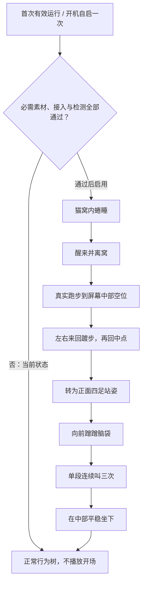

# 陈皮待补动画合集 v5

共 **41条待制作动画（99—139）**、**8个新增候选姿态锚点**、**1项三连叫同步音频**。不是41条都必须先做：P0的11条用于新开场，P1的6条优先消除日常绕路；其他按需补齐。已补齐82张逐动作首尾副本、41份独立提示词和图文索引；8张新锚点待用户评审，尚无新视频，未启用开场。

入口：[图文索引](index.html)。页面内嵌全部原图、提示词与相关说明，可独立打开，不依赖压缩软件是否同时解出图片。也可完整解压后，打开动作目录直接上传首帧.png和尾帧.png，复制提示词.txt全文。

用户明确：**等独立跑步素材补齐后再启用开场**。现有走路不能加速冒充跑步。开场另需正面四足站姿及蹭头/三连叫/坐下素材，不能先坐下再拿坐姿动画替代。

## 制作顺序

1. 先审阅已补齐的RR右跑相位、RL左跑相位、SF正面四足站姿三个候选图，确认身份、眼睛、脚底和体型。
2. 制作108—118共11条开场必需片，优先一起补99/100侧坐直接起身。
3. 补101—104站立与趴卧直连、105—107左向起身、119/120站姿致谢。
4. 121—139为可选低位换姿及五种躺姿的起提/悬空/落地；H_D/H_A/H_B/H_X/H_M五个悬空锚点也已提供，投片前先评审托举和重力表现。

## 独立启动开场

开场对外表现为一段连续的专属演出，内部共用姿态端点，以适应猫窝位置和屏幕宽度。**当前是流程设计，尚未接入自动触发。** 普通重开、宿主重建和休眠恢复不重复播放；首次运行与自启同时满足只播一次。触发去重应在开始时持久化，取消或中途退出也不自动重来。

中部被家具占用时选最近可坐空位；不搬物品、不坐在盆里。照料期限继续计时、库存不变，完整坐定才交回普通调度。手动拖拽/命令可取消开场。全屏/主动隐藏应暂停表演进度，声音遵守静音设置。待接入时开放窝内等待、踱步范围/往返、跑步物理速度等参数；目前这些不是已生效的运行参数。

镜头固定、不把猫窝烘焙进角色视频；猫窝是场景物件，离窝支撑与前沿遮挡由程序计算。三次叫声只在117内发生，需给出三个开嘴峰值时间点；三次之后合嘴，118才坐下。

## 完整清单

| 编号 | 动作 | 首尾 | 优先级 | 分组 |
|---|---|---|---|---|
| 99 | [侧坐直接朝右站起](099-侧坐直接朝右站起/制作说明.md) | I→SR | P1 | 基础衔接 |
| 100 | [侧坐直接朝左站起](100-侧坐直接朝左站起/制作说明.md) | I→SL | P1 | 基础衔接 |
| 101 | [朝右站姿直接趴卧](101-朝右站姿直接趴卧/制作说明.md) | SR→D | P1 | 基础衔接 |
| 102 | [朝左站姿直接趴卧](102-朝左站姿直接趴卧/制作说明.md) | SL→D | P1 | 基础衔接 |
| 103 | [趴卧直接朝右站起](103-趴卧直接朝右站起/制作说明.md) | D→SR | P1 | 基础衔接 |
| 104 | [趴卧直接朝左站起](104-趴卧直接朝左站起/制作说明.md) | D→SL | P1 | 基础衔接 |
| 105 | [侧躺直接朝左站起](105-侧躺直接朝左站起/制作说明.md) | A→SL | P2 | 左向起身 |
| 106 | [露肚直接朝左站起](106-露肚直接朝左站起/制作说明.md) | B→SL | P2 | 左向起身 |
| 107 | [舒展直接朝左站起](107-舒展直接朝左站起/制作说明.md) | X→SL | P2 | 左向起身 |
| 108 | [朝右跑步起步](108-朝右跑步起步/制作说明.md) | SR→RR | P0 | 开场跑步 |
| 109 | [朝右跑步循环](109-朝右跑步循环/制作说明.md) | RR→RR | P0 | 开场跑步 |
| 110 | [朝右跑步停稳](110-朝右跑步停稳/制作说明.md) | RR→SR | P0 | 开场跑步 |
| 111 | [朝左跑步起步](111-朝左跑步起步/制作说明.md) | SL→RL | P0 | 开场跑步 |
| 112 | [朝左跑步循环](112-朝左跑步循环/制作说明.md) | RL→RL | P0 | 开场跑步 |
| 113 | [朝左跑步停稳](113-朝左跑步停稳/制作说明.md) | RL→SL | P0 | 开场跑步 |
| 114 | [朝右站姿转正面四足](114-朝右站姿转正面四足/制作说明.md) | SR→SF | P0 | 开场互动 |
| 115 | [朝左站姿转正面四足](115-朝左站姿转正面四足/制作说明.md) | SL→SF | P0 | 开场互动 |
| 116 | [正面站立向前蹭头](116-正面站立向前蹭头/制作说明.md) | SF→SF | P0 | 开场互动 |
| 117 | [正面站立连续叫三次](117-正面站立连续叫三次/制作说明.md) | SF→SF | P0 | 开场互动 |
| 118 | [正面四足平稳坐下](118-正面四足平稳坐下/制作说明.md) | SF→F | P0 | 开场互动 |
| 119 | [朝右站立致谢](119-朝右站立致谢/制作说明.md) | SR→SR | P2 | 照料衔接 |
| 120 | [朝左站立致谢](120-朝左站立致谢/制作说明.md) | SL→SL | P2 | 照料衔接 |
| 121 | [蜷睡转趴卧](121-蜷睡转趴卧/制作说明.md) | C→D | P3 | 低位换姿 |
| 122 | [趴卧卷成蜷睡](122-趴卧卷成蜷睡/制作说明.md) | D→C | P3 | 低位换姿 |
| 123 | [蜷睡放松侧躺](123-蜷睡放松侧躺/制作说明.md) | C→A | P3 | 低位换姿 |
| 124 | [侧躺卷成蜷睡](124-侧躺卷成蜷睡/制作说明.md) | A→C | P3 | 低位换姿 |
| 125 | [趴卧被提起](125-趴卧被提起/制作说明.md) | D→H_D | P3 | 拖拽补齐 |
| 126 | [趴卧对应悬空轻摆](126-趴卧对应悬空轻摆/制作说明.md) | H_D→H_D | P3 | 拖拽补齐 |
| 127 | [趴卧对应放回地面](127-趴卧对应放回地面/制作说明.md) | H_D→D | P3 | 拖拽补齐 |
| 128 | [侧躺被提起](128-侧躺被提起/制作说明.md) | A→H_A | P3 | 拖拽补齐 |
| 129 | [侧躺对应悬空轻摆](129-侧躺对应悬空轻摆/制作说明.md) | H_A→H_A | P3 | 拖拽补齐 |
| 130 | [侧躺对应放回地面](130-侧躺对应放回地面/制作说明.md) | H_A→A | P3 | 拖拽补齐 |
| 131 | [露肚被提起](131-露肚被提起/制作说明.md) | B→H_B | P3 | 拖拽补齐 |
| 132 | [露肚对应悬空轻摆](132-露肚对应悬空轻摆/制作说明.md) | H_B→H_B | P3 | 拖拽补齐 |
| 133 | [露肚对应放回地面](133-露肚对应放回地面/制作说明.md) | H_B→B | P3 | 拖拽补齐 |
| 134 | [舒展被提起](134-舒展被提起/制作说明.md) | X→H_X | P3 | 拖拽补齐 |
| 135 | [舒展对应悬空轻摆](135-舒展对应悬空轻摆/制作说明.md) | H_X→H_X | P3 | 拖拽补齐 |
| 136 | [舒展对应放回地面](136-舒展对应放回地面/制作说明.md) | H_X→X | P3 | 拖拽补齐 |
| 137 | [掩面被提起](137-掩面被提起/制作说明.md) | M→H_M | P3 | 拖拽补齐 |
| 138 | [掩面对应悬空轻摆](138-掩面对应悬空轻摆/制作说明.md) | H_M→H_M | P3 | 拖拽补齐 |
| 139 | [掩面对应放回地面](139-掩面对应放回地面/制作说明.md) | H_M→M | P3 | 拖拽补齐 |

## 现有素材与缺口边界

- 已有：左右走/转身、20蜷睡、21醒来、38坐姿蹭手、88坐姿叫、70/74/78右起身，均不重复列为缺片。
- 119/120站姿致谢可减少补给后为了51坐姿致谢而坐下；当前49→07→51是有效现有路径。
- 86右走叫步态相位、62/63翻身和74起身形体属于返片精修，不是没有动作。
- C表示旧蜷睡；X表示新舒展（v4原图文件名C-侧躺舒展），不能把两个C混为同姿态。
- H_*为各原姿态独立生成的对应悬空候选；没有借用旧H改名冒充匹配。
- 当前静音规则不变；7段用户原声已到并接入现有叫声动作；117返片后的三次嘴型同步仍待完成，开场未启用。

manifest.json记录18张共享锚点的路径及SHA256。anchors目录包含10张已有原字节图及8张新候选；每条动作目录均有首帧.png、尾帧.png、提示词.txt、动作信息.json和制作说明.md。首尾共用锚点保证文件完全一致，不表示几何或动态验收完成。新增锚点的生成提示词见anchor-generation.json，限制见静态审核.md。
