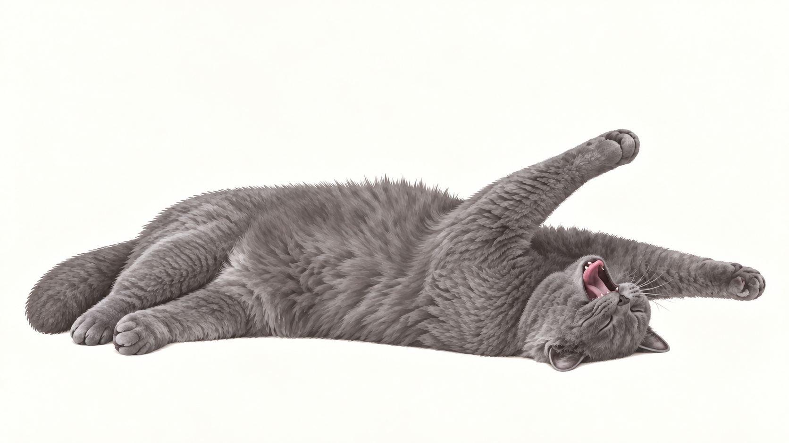

# 陈皮新动作视频制作包 v4 · 照片姿态修订版

2026-09-20：按用户重新提供的8张参考及随后指定的扶墙/捂脸标准图，重画7张姿态，另补1张仰躺哈欠峰值。旧版否决记录保留在[返工清单](参考返工-20260920.md)。当前为修订候选，等待用户美术评审及视频返片，不等于运行时动画已完成。

沿用52—98共47条任务编号、12个共享首尾锚点（7张重画、5张basic-v2原字节复用）及94张首尾副本。旧目录名保留以免已有任务链接失效；实际姿态以新图和完整提示词为准，C现在是背向侧瘫，M现在是整身蜷团。

[图文索引](index.html)含新图总览、逐条首尾配图和提示词；[动作表](动作表.csv)含每条时间；[行为衔接](行为衔接.md)含15秒点击规则。检查工具为仓库的tools/package_expressions_v4.py，读取已查看图的SHA256后生成副本，不能用旧图无提示覆盖。

## 照片与关键图

| 图 | 本次具体姿态 | 依据及设计范围 |
|---|---|---|
| HR/HL | 身体向墙倾斜，上掌耳侧/下掌胸前贴墙、回头略歪、尾下垂 | 新增扶墙标准图09覆盖原01的具体姿态；HL独立生成 |
| A | 左侧脸贴地、前爪屈曲、后腿一长一屈、尾靠后腿 | 参考05为主，04/07核对侧脸及肩颈松弛 |
| B | 背部承重、右侧头后仰贴地、两前腿向头顶一高一低展开，闭嘴 | 参考02推导的动作前闭嘴基态，不声称照片本身是闭嘴 |
| C | 背朝观察者、近臀远头、不见正脸，腿与尾不对称松弛 | 新参考08 |
| M | 低伏侧面蜷睡，头在左埋于前爪、前臂遮脸、尾围前缘 | 新增捂脸标准图10覆盖原03俯视团姿 |
| D | 朝右胸腹贴地、低头放松趴卧 | 设计用连接姿态；07只约束头颈和短毛，不声称照片提供此完整姿势 |
| F/SR/SL/WR/WL | 原正面坐姿、左右站/走相位 | basic-v2原字节复用，未重画旧基础动作 |

**81使用峰值图作为中间动作参考，首尾仍是闭嘴B。** 支持额外参考图的平台可附上peaks/B-仰躺哈欠峰值.png；只支持首尾的平台仍上传81目录两图，并采用完整提示词。不要把峰值误作循环尾帧，不要整段张嘴。

## 时长与真实转向

每条独立1.2—5.6秒，不统一5秒。新A头在左，B头在右，C背向，M蜷团：60—65需要真实换爪、转肩转胯，约4.0—4.4秒；83卷身掩面4.2秒、85解卷4秒。镜头固定，猫自己转向；不能绕相机或头尾瞬换。完整动作放不进时长时延长本段，不能加速原步态。

走路叫86/87仍保持右3.25秒（39/24秒步态的两个周期）、左5秒（120/24秒一个周期），不修改已有片段。15秒一击轻抖、二击稍强抖并回头叫、三击起身规则保持。没有新视频的动作不装入运行时。

## 静态与动态验收边界

图为1672×941横画幅、浅暖灰不透明背景；完整提示词和参考用途记录见[修订生成记录](修订生成记录.json)。已逐张查看照片中的姿态细节，详见[静态审核](静态审核.md)。新版覆盖旧姿态判断，不自动视为用户认可。

**相同画幅不等于像素高度和体型已统一。** 不同姿态有投影、身体接触面及头部朝向变化，模型也没有严格遵守指定接触像素。返片前后都须量测同姿态端点、头骨/胸廓尺度、脚或侧腹接触和相邻帧变化；不凭总外框/尾尖最低点对齐，不用瞬间缩放补高度。对实际存在的视角或比例跳变重制端点/视频，不能靠提示词宣称解决。

图中只含猫；墙、家具、人手、界面、水印和烘焙阴影不纳入动画。参考截图原件保存在本地私有参考目录，生成图和制作文档上传指定Git。

## 2026-09-20 M画风统一

用户确认M掩面图的画风与其他图不一致。本轮以内置image_gen保留低侧视蜷睡、埋脸遮面及尾围前缘，以同组A/D统一细密短毛、柔和灰阶，替换此前大块浅色斑驳笔触。母图及83尾帧、84首尾帧、85首帧同步，动作分类与4.2/5.6/4秒时长不变。1672×941尺寸和共享哈希已检查；助手已静态查看，仍待用户美术评审与视频动态验收。提示词见[prompts/M-style-unification-20260920.md](prompts/M-style-unification-20260920.md)。

## M画风第二次纠正 r5

用户指出上一版仍与其他图差异很大，撤销上一节“统一”完成判断。再次以旧M作姿态图片参考的r4仍受旧图影响，未采用；r5仅以A侧躺图为角色和画风参考重新绘制。毛簇、软爪和胸腹暗部更接近A，具体轮廓/爪位有重绘差异，仍保留低侧视掩面蜷睡结构。新版为待评审候选；[上一版/新版/同组A三图对照](reviews/m-style-r5/index.html)。83—85动作及4.2/5.6/4秒不变；运行时未动。

## 动画动作表

| 动作 / 提示词 | 首尾共用锚点 | 类型 | 目标时长 |
|---|---|---|---|
| [52-右边抬身扶墙](52-右边抬身扶墙/提示词.txt) | SR → HR | 过渡 | 3s |
| [53-右边扶墙微动](53-右边扶墙微动/提示词.txt) | HR → HR | 循环 | 3.2s |
| [54-右边落回四足](54-右边落回四足/提示词.txt) | HR → SR | 过渡 | 2.2s |
| [55-左边抬身扶墙](55-左边抬身扶墙/提示词.txt) | SL → HL | 过渡 | 3s |
| [56-左边扶墙微动](56-左边扶墙微动/提示词.txt) | HL → HL | 循环 | 3.2s |
| [57-左边落回四足](57-左边落回四足/提示词.txt) | HL → SL | 过渡 | 2.2s |
| [58-坐姿放松趴下](58-坐姿放松趴下/提示词.txt) | F → D | 过渡 | 2.8s |
| [59-趴卧恢复坐姿](59-趴卧恢复坐姿/提示词.txt) | D → F | 过渡 | 2.6s |
| [60-趴卧放松侧瘫](60-趴卧放松侧瘫/提示词.txt) | D → A | 过渡 | 4.2s |
| [61-侧瘫翻回趴卧](61-侧瘫翻回趴卧/提示词.txt) | A → D | 过渡 | 4s |
| [62-侧瘫翻成露肚](62-侧瘫翻成露肚/提示词.txt) | A → B | 过渡 | 4.4s |
| [63-露肚翻回侧瘫](63-露肚翻回侧瘫/提示词.txt) | B → A | 过渡 | 4.2s |
| [64-侧瘫舒展开四肢](64-侧瘫舒展开四肢/提示词.txt) | A → C | 过渡 | 4.2s |
| [65-舒展收回侧瘫](65-舒展收回侧瘫/提示词.txt) | C → A | 过渡 | 4.2s |
| [66-趴卧安静呼吸](66-趴卧安静呼吸/提示词.txt) | D → D | 循环 | 4.2s |
| [67-侧瘫平躺呼吸](67-侧瘫平躺呼吸/提示词.txt) | A → A | 循环 | 4.8s |
| [68-侧瘫首次点击轻抖](68-侧瘫首次点击轻抖/提示词.txt) | A → A | 单次 | 1.2s |
| [69-侧瘫二次点击回头叫](69-侧瘫二次点击回头叫/提示词.txt) | A → A | 单次 | 2.2s |
| [70-侧瘫三次点击起身](70-侧瘫三次点击起身/提示词.txt) | A → SR | 过渡 | 3.8s |
| [71-露肚平躺呼吸](71-露肚平躺呼吸/提示词.txt) | B → B | 循环 | 4.8s |
| [72-露肚首次点击轻抖](72-露肚首次点击轻抖/提示词.txt) | B → B | 单次 | 1.2s |
| [73-露肚二次点击回头叫](73-露肚二次点击回头叫/提示词.txt) | B → B | 单次 | 2.2s |
| [74-露肚三次点击起身](74-露肚三次点击起身/提示词.txt) | B → SR | 过渡 | 3.4s |
| [75-舒展平躺呼吸](75-舒展平躺呼吸/提示词.txt) | C → C | 循环 | 4.8s |
| [76-舒展首次点击轻抖](76-舒展首次点击轻抖/提示词.txt) | C → C | 单次 | 1.2s |
| [77-舒展二次点击回头叫](77-舒展二次点击回头叫/提示词.txt) | C → C | 单次 | 2.2s |
| [78-舒展三次点击起身](78-舒展三次点击起身/提示词.txt) | C → SR | 过渡 | 4s |
| [79-趴卧打哈欠](79-趴卧打哈欠/提示词.txt) | D → D | 单次 | 3.4s |
| [80-侧瘫打哈欠](80-侧瘫打哈欠/提示词.txt) | A → A | 单次 | 3.4s |
| [81-露肚平躺打哈欠](81-露肚平躺打哈欠/提示词.txt) | B → B | 单次 | 3.8s |
| [82-舒展平躺打哈欠](82-舒展平躺打哈欠/提示词.txt) | C → C | 单次 | 3.4s |
| [83-侧瘫抬爪掩面入睡](83-侧瘫抬爪掩面入睡/提示词.txt) | A → M | 过渡 | 4.2s |
| [84-掩面睡眠呼吸](84-掩面睡眠呼吸/提示词.txt) | M → M | 循环 | 5.6s |
| [85-掩面醒来放爪](85-掩面醒来放爪/提示词.txt) | M → A | 过渡 | 4s |
| [86-向右走路叫一声](86-向右走路叫一声/提示词.txt) | WR → WR | 单次 | 3.25s |
| [87-向左走路叫一声](87-向左走路叫一声/提示词.txt) | WL → WL | 单次 | 5s |
| [88-坐着叫一声](88-坐着叫一声/提示词.txt) | F → F | 单次 | 1.8s |
| [89-趴着叫一声](89-趴着叫一声/提示词.txt) | D → D | 单次 | 1.8s |
| [90-侧瘫叫一声](90-侧瘫叫一声/提示词.txt) | A → A | 单次 | 1.8s |
| [91-露肚平躺叫一声](91-露肚平躺叫一声/提示词.txt) | B → B | 单次 | 1.8s |
| [92-舒展平躺叫一声](92-舒展平躺叫一声/提示词.txt) | C → C | 单次 | 2.2s |
| [93-朝右站立伸懒腰](93-朝右站立伸懒腰/提示词.txt) | SR → SR | 单次 | 4s |
| [94-朝左站立伸懒腰](94-朝左站立伸懒腰/提示词.txt) | SL → SL | 单次 | 4s |
| [95-趴卧伸懒腰](95-趴卧伸懒腰/提示词.txt) | D → D | 单次 | 3.6s |
| [96-侧瘫伸懒腰](96-侧瘫伸懒腰/提示词.txt) | A → A | 单次 | 3.6s |
| [97-露肚平躺伸懒腰](97-露肚平躺伸懒腰/提示词.txt) | B → B | 单次 | 3.8s |
| [98-舒展平躺伸懒腰](98-舒展平躺伸懒腰/提示词.txt) | C → C | 单次 | 3.6s |
