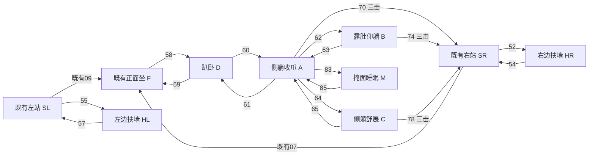

# 行为树接入与连续性约定

## 接现有结构

继续以当前照料期限、拖拽、全屏避让和休息优先为上层控制。新动作是待返片的叶节点与姿态转换，不增加频繁漫游、不调整吃喝/如厕时钟。屏幕扶墙只在猫已经靠近左右有效屏边且后脚有地面支撑时可选，不远距离自动去爬墙，不吸附其他程序窗口，不向屏幕上方爬出。普通空地不播放扶空气动作。

所有节点都有进入、原姿态表现和退出。B与C互换必须经过A，不能B→C瞬切。旧蜷睡需先经21醒到I、18回F，再58→60进入新平躺；不把新姿态直接覆盖旧睡眠循环。起身到SR后用现有15真实转向SL，之后12左起步；向右用10起步。墙前先走到合适根节点位置并完成11/13停步，再52/55抬身。

## 平躺15秒点击窗口

执行约定：第一下有效单击时开启固定15秒窗口，期间累计1、2、3次，第二次不延长窗口；第15秒边界之前属于当前窗口，到达/超过边界重新从1计。有效点击为猫实体上一次按下与松开；长按提起不是点击，家具点击不计，抖动期间正常计数，OS双击事件不能重复加一次。

| 姿态 | 第一次 | 第二次 | 第三次 |
|---|---|---|---|
| A | 68轻抖→A | 69强一点抖＋回头叫一次→A | 70→SR |
| B | 72轻抖→B | 73强一点抖＋回头叫一次→B | 74→SR |
| C | 76轻抖→C | 77强一点抖＋回头叫一次→C | 78→SR |

第一次立即开始反应，不等15秒收集。快速第二击/第三击更新一个待执行等级，不无限堆队列。若轻抖已在播放，完成其短回接再接第二档；第三击优先，把尚未开始的第二档取消，在当前片段回到同姿态的最早安全锚点后起身。已经开始的回头叫只完成一次，不硬切身体、不重复叫。第三击退出平躺并清零；之后普通点击沿原互动规则。

窗口内锁住A/B/C，不让随机换姿态把累计点击清零或换掉反应图。哈欠、伸展及单次叫不自动提升点击等级；有点击命令时先在该片段的自然回接点回到对应A/B/C，再执行点击等级。正常闲置超过窗口后清零。每次循环末端都提供可返回的同姿态，不让输入等待整个睡眠周期；实际响应延迟需在返片时标注安全出口并验收。

掩面M属于睡眠：遵循既有一次点击立即唤醒，85放爪到A；这次唤醒不当成平躺第三击计数，进入A后重新开计数。若唤醒同时有照料指令，85→70到SR后接原照料路径。睡眠期限到期仍继续睡，不因为新增素材自动站起漫游。

## 连续中断与支撑

拖拽/全屏隐藏的既有优先级不降低。拖拽输入立即接管逻辑；返片接入时若当前平躺直接转现有正面拎起32会产生跳姿，必须提供匹配的姿态接起方案或沿用已验证的即时拖动呈现，不能生硬截成F再提起。本包不虚称已补齐所有空中姿态转换。

新平躺先用于安全地面，保持完整横向躺姿范围避让家具；猫窝是否容纳展开的B/C必须用整个躯干范围判断，不能只看根节点。不把长平躺硬塞猫窝。M可用于地面，窝内使用要另跑已有窝沿场景审计。后脚承重/胸腹接触改变时，运行时世界支撑面仍连续。

扶墙的屏边接触坐标来自最终HR/HL前爪图，按同一个竖面定位；后脚始终在地面，因贴墙可缩短末段位移但保持完整停步和抬身动作。离墙54/57落回四脚后再转向离开；左侧和右侧是不同图片，不能镜像调换自身大小眼。

走路叫86/87在已有循环共同相位插入，首尾角速度和脚步速度匹配，保持根节点位移预算；若目的地剩余距离不足以走完该片段，先正常停步，选择坐着叫88，不用加速、滑步或走过目标完成叫声。哈欠79—82与伸懒腰93—98都是一次性返回原姿态，不能无间隔反复抖动。

## 接入后的必须回归

- A/B/C各测试0、1、2、3次点击、连续快击、14.9/15.0秒窗口边界、动作中升级，以及起身后计数清零。
- 三种平躺进入/换姿/回接/退出；掩面睡眠循环与立即唤醒；哈欠、叫声、伸展中接新命令。
- 两侧扶墙全链，窗口大小/DPI变化、屏幕边缘和拖拽取消，无悬空支撑。
- 新片段内部相邻帧、全部循环及与01/06—21的接缝都跑逐帧尺寸和脚底检查；窝内另跑场景遮挡检查。

以上是明确的接入设计与验收项目；当前运行时尚未开启这些新动作，外部视频返片前不声称这些交互已实现或已动态验收。
